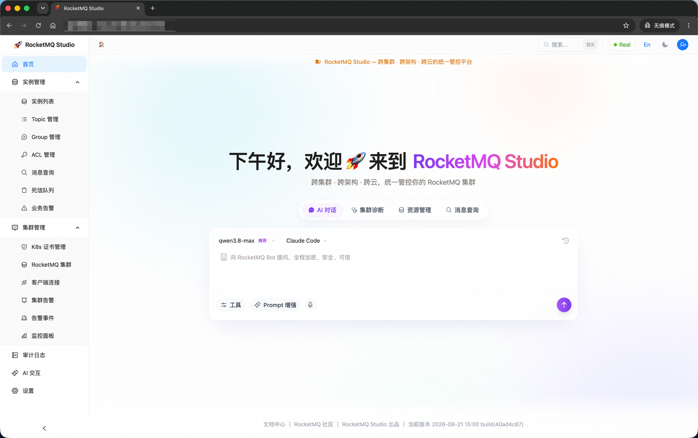
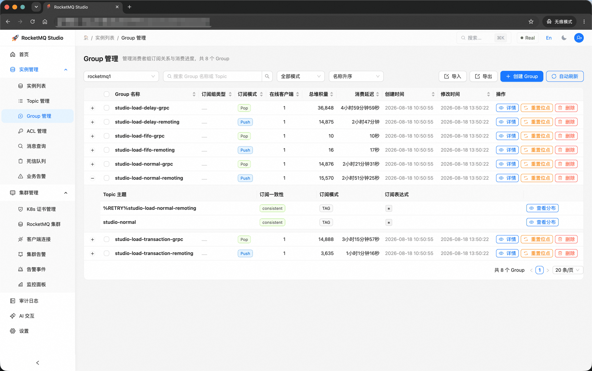
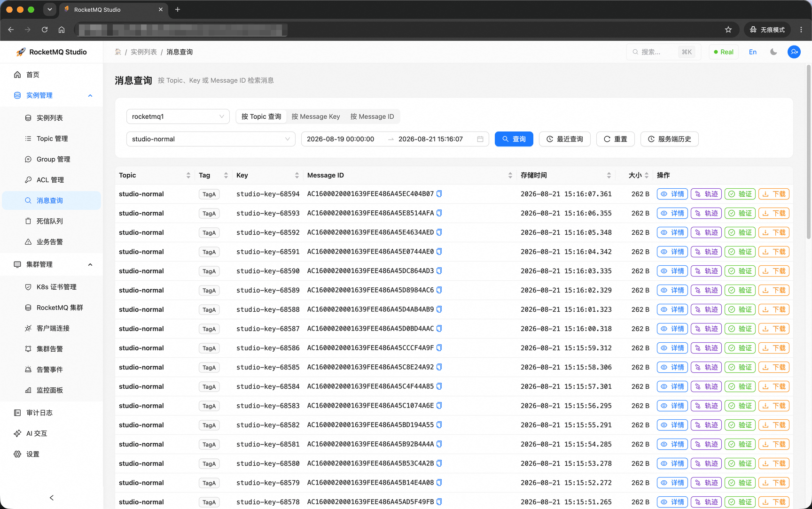

# RocketMQ Studio

**English** | [中文](README_zh.md)

> Cross-cluster · Cross-architecture · Cross-cloud unified RocketMQ management platform

RocketMQ Studio is a unified management platform for RocketMQ, supporting multi-cluster, multi-architecture, and multi-cloud environments. It provides instance management, cluster operations, Topic / Consumer Group CRUD, ACL permission control, message query and tracing, dead letter queue handling, monitoring alerts, audit logs, and an AI assistant.

## Quick Start

```bash
cd deploy/rocketmq && docker compose up -d
cd .. && docker compose up -d --build
```

Visit **http://127.0.0.1:6789** after startup.

The first command starts the bundled RocketMQ topology and creates the
`rocketmq_net` Docker network used by the Studio services. Check that it
is healthy before starting Studio with `docker compose ps` from `deploy/rocketmq`.
The default schema creates only Studio tables. It does not seed instances, topics, consumer groups, or ACL
records. Development-only sample data can be imported explicitly from `deploy/mysql/`; it is not part of the
default deployment. Import `upgrade-demo-instance.sql` first and then `upgrade-demo-acl.sql`; both scripts
target the current numeric-ID schema and are idempotent. They are sample-data loaders, not upgrade migrations,
and should never be imported into a production database.
Production schema changes are applied automatically by Flyway. The legacy
`deploy/mysql/upgrade-*.sql` schema upgrade scripts are superseded and must not be run for new deployments or
existing-volume upgrades.
Automatic existing-volume upgrades start from the standardized numeric-ID schema introduced by #2317.
Back up and convert older VARCHAR/UUID-ID databases before enabling Flyway; the migration aborts rather than
partially rewriting an unsupported layout.

**Studio ports:** Frontend 6789 (Nginx), Backend 8888 (Spring Boot)

**RocketMQ ports:** NameServer 9876, Broker 10911, Proxy Remoting 8080, Proxy gRPC 8081

To enable login protection for a shared environment, copy `deploy/.env.example` to
`deploy/.env`, set `STUDIO_AUTH_LOGIN_REQUIRED=true`, and configure
`STUDIO_AUTH_ADMIN_USERNAME` / `STUDIO_AUTH_ADMIN_PASSWORD`. These configured credentials are a
bootstrap seed: on the first login against an empty database Studio creates the configured users
in the `rmq_studio_user` table, and the database becomes the source of truth afterwards.
Administrators manage accounts (create users, enable/disable, reset passwords) on the
user-management page; browsers authenticate with an `HttpOnly` session cookie, and API clients can
request a bearer token explicitly. Disabling login protection only skips API interception for local
development.

## Screenshots

**Dashboard · AI chat** — a single entry point that switches between AI chat, cluster diagnosis, resource management, and message query, with model selection and MCP tool calls.



**Consumer group management** — the group list shows subscription mode, online clients, total lag, and consumption delay; expanding a row reveals per-Topic subscription consistency and filter expressions, alongside offset reset and config import/export.



**Message query** — search messages by Topic / Message Key / Message ID within a time range, then inspect details, trace, verification, or download a single message.



## Features

| Module | Capabilities |
|--------|--------------|
| **Dashboard** | Global statistics for clusters, brokers, topics, and consumer groups with TPS trends |
| **Instances** | Multi-instance access (Proxy / Direct mode), instance CRUD |
| **Clusters** | Cluster details, Broker / NameServer / Proxy node operations, hot config updates, NameServer configuration drift detection |
| **K8s Certs** | TLS / mTLS / ServiceAccount certificate management and renewal |
| **Topics** | Topic CRUD, route viewer, consumer list, multi-type support (Normal / FIFO / Delay / Transaction / Lite) |
| **Consumer Groups** | Consumer group CRUD, consumption progress, subscription details, offset reset, config import/export |
| **ACL** | ACL rules and user management, v1 / v2 dual version support |
| **Messages** | Query by Topic / MsgId / Key / time range, message trace visualization |
| **Dead Letter Queue** | DLQ message viewing and batch resend |
| **Clients** | Producer / Consumer online connection list, protocol and language version stats |
| **Alert Rules** | Multi-dimensional alert rules (disk / lag / TPS / node offline), DingTalk / email / SMS notifications |
| **System Alerts** | System-level alert viewing, acknowledgment, and cleanup |
| **Audit Logs** | Operation audit log query, filter by type / time / result, history cleanup |
| **AI Assistant** | SSE streaming chat, supports query / diagnose / manage / general modes, MCP tool integration |
| **Settings** | General preferences, LLM config, datasource management |

## Tech Stack

- **Frontend** — React 18 + TypeScript + Vite + Ant Design + Tailwind CSS
- **Backend** — Java 21 + Spring Boot 3.5 + Hexagonal Architecture (ArchUnit enforced)
- **Deployment** — Docker multi-stage builds, Nginx reverse proxy, Docker Compose or `deploy.sh` for remote deployment

## Development Guidelines

- **Code Style** — ESLint + Prettier for frontend, Husky pre-commit hook for auto-check
- **Commit Format** — Conventional Commits (`feat:` / `fix:` / `refactor:` / `chore:` / `docs:` / `perf:`)
- **Architecture Tests** — `mvn test` runs ArchUnit hexagonal architecture constraint checks
- **i18n** — New frontend text must include both Chinese and English translations (`web/src/i18n/`)
- **Table Width** — Tables must not show a horizontal scrollbar by default (only allowed when the window/container is manually narrowed); use `tableScrollX(columns)` from `web/src/utils/table.ts` to compute `scroll.x` from declared column widths instead of hardcoded magic numbers; when a modal contains a wide table, adjust the modal `width` dynamically per active tab (e.g., Group detail: Overview 800 / Progress 1080) so that container width ≥ table width; long-text columns (e.g., long Topic names) should use `ellipsis: true` + `title` for hover-to-see-full-name truncation (no wrapping)

## License

[Apache License 2.0](LICENSE)
