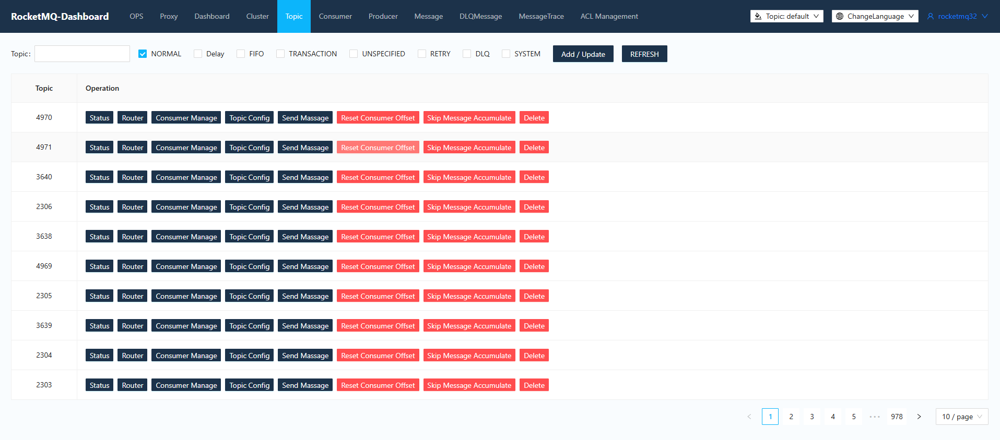
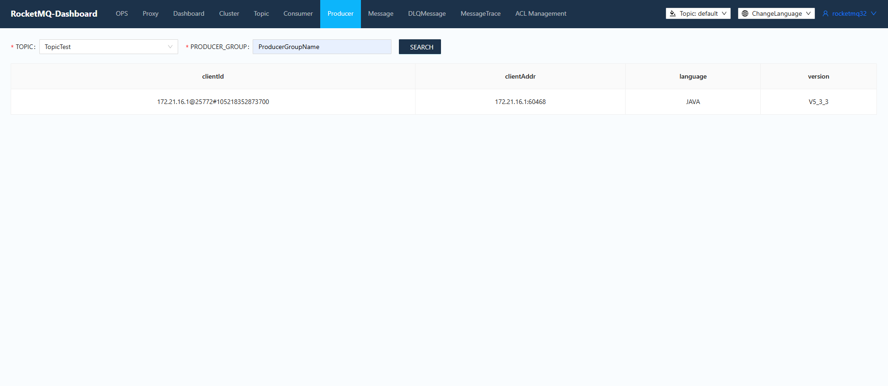
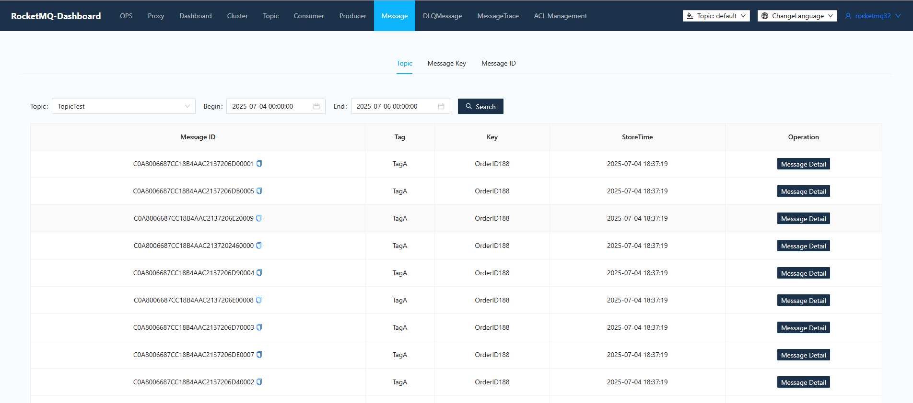
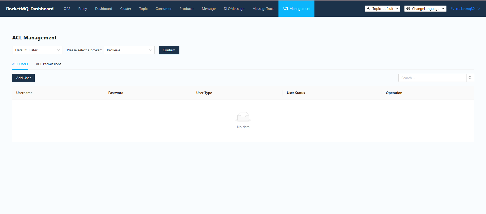

# RocketMQ使用文档

## 运维页面
* 你可以修改这个服务使用的namesrv的地址

* 你可以修改这个服务是否使用VIPChannel(如果你的mq server版本小于3.5.8，请设置不使用)

  

## 驾驶舱
* 查看broker的消息量（总量/5分钟图）
* 查看单一主题的消息量（总量/趋势图）


## 集群页面
* 查看集群的分布情况
    * cluster与broker关系
    * broker
* 查看broker具体信息/运行信息
* 查看broker配置信息


## 主题页面
* 展示所有的主题，可以通过搜索框进行过滤
* 筛选 普通/重试/死信 主题
    * 支持延迟/顺序/事务消息的筛选
    * 支持延迟/顺序/事物/普通等多种消息类型主题的新增与更新
* 添加/更新主题
    * clusterName 创建在哪几个cluster上
    * brokerName 创建在哪几个broker上
    * topicName 主题名
    * writeQueueNums  写队列数量
    * readQueueNums  读队列数量
    * perm //2是写 4是读 6是读写
* 状态 查询消息投递状态（投递到哪些broker/哪些queue/多少量等）
* 路由 查看消息的路由（现在你发这个主题的消息会发往哪些broker，对应broker的queue信息）
* CONSUMER管理（这个topic都被哪些group消费了，消费情况何如）
* topic配置（查看变更当前的配置）
* 发送消息（向这个主题发送一个测试消息）
* 重置消费位点(分为在线和不在线两种情况，不过都需要检查重置是否成功)
* 删除主题 （会删除掉所有broker以及namesrv上的主题配置和路由信息）



## 消费者页面
* 展示所有的消费组，可以通过搜索框进行过滤
* 刷新页面
* 按照订阅组/数量/TPS/延迟 进行排序
* 添加/更新消费组
    * clusterName 创建在哪几个集群上
    * brokerName 创建在哪几个broker上
    * groupName  消费组名字
    * consumeEnable //是否可以消费 FALSE的话将无法进行消费
    * consumeBroadcastEnable //是否可以广播消费
    * retryQueueNums //重试队列的大小
    * brokerId //正常情况从哪消费
    * whichBrokerWhenConsumeSlowly//出问题了从哪消费
* 终端 在线的消费客户端查看，包括版本订阅信息和消费模式
* 消费详情 对应消费组的消费明细查看，这个消费组订阅的所有Topic的消费情况，每个queue对应的消费client查看（包括Retry消息）
* 配置 查看变更消费组的配置
* 删除 在指定的broker上删除消费组
* 是否使用代理进行查询
* 消费页面
    * 支持顺序消费类型订阅组的过滤
    * 提供顺序消费类型订阅组的新增与更新，如果需要开启顺序消费，FIFO类型的订阅组一定需要打开consumeOrderlyEnable选项


## 发布管理页面
* 通过Topic和Group查询在线的消息生产者客户端
    * 信息包含客户端主机 版本
    



## 消息查询页面
* 根据Topic和时间区间查询
    *由于数据量大 最多只会展示2000条，多的会被忽略 
* 根据Topic和Key进行查询
    * 最多只会展示64条
* 根据消息主题和消息Id进行消息的查询
* 消息详情可以展示这条消息的详细信息，查看消息对应到具体消费组的消费情况（如果异常，可以查看具体的异常信息）。可以向指定的消费组重发消息。



## 代理页面
* 代理页面（RocketMQ 5.0新增） 
  * 支持代理节点的新增与查询
  * 支持代理节点地址配置：在application.yml中可对proxyAddr和proxyAddrs属性进行预配置


## ACL2.0管理界面

- 支持根据broker地址的acl规则的查询
- acl规则的修改、新增、删除、查找
- （不再支持acl1.0）



## HTTPS 方式访问Dashboard

* HTTPS功能实际上是使用SpringBoot提供的配置功能即可完成，首先，需要有一个SSL KeyStore来存放服务端证书，可以使用本工程所提供的测试密钥库:
resources/rmqcngkeystore.jks, 它可以通过如下keytool命令生成
```
#生成库并以rmqcngKey别名添加秘钥
keytool -genkeypair -alias rmqcngKey  -keyalg RSA -validity 3650 -keystore rmqcngkeystore.jks 
#查看keystore内容
keytool -list -v -keystore rmqcngkeystore.jks 
#转换库格式
keytool -importkeystore -srckeystore rmqcngkeystore.jks -destkeystore rmqcngkeystore.jks -deststoretype pkcs12 
```

* 配置resources/application.properties, 打开SSL的相关选项, 启动dashboard后即开启了HTTPS.
```
#设置https端口
server.port=8443

### SSL setting
#server.ssl.key-store=classpath:rmqcngkeystore.jks
#server.ssl.key-store-password=rocketmq
#server.ssl.keyStoreType=PKCS12
#server.ssl.keyAlias=rmqcngkey
```

## 登录访问Dashboard
在访问Dashboard时支持按用户名和密码登录控制台，在操作完成后登出。需要做如下的设置:

* 1.在Spring配置文件resources/application.properties中修改rocketmq.config.loginRequired=true开启登录功能
```$xslt
# 开启登录功能
rocketmq.config.loginRequired=true

# Dashboard文件目录，登录用户配置文件所在目录
rocketmq.config.dataPath=/tmp/rocketmq-console/data
```
* 2.确保${rocketmq.config.dataPath}定义的目录存在，并且该目录下创建登录配置文件"users.properties", 如果该目录下不存在此文件，则默认使用resources/users.properties文件。 ps: 如果rocketmq启用了acl，控制台必须配置ak和sk，同时application.yml中的rocketmq.config.authmode 需要为acl且登录功能需要打开才能正常使用，登录后将使用acl2.0中的用户名和密码构造rpchook与broker进行通信。
users.properties文件格式为:
```$xslt
# 该文件支持热修改，即添加和修改用户时，不需要重新启动console
# 格式， 每行定义一个用户， username=password[,N]  #N是可选项，可以为0 (普通用户)； 1 （管理员）  

#定义管理员 
admin=admin,1

#定义普通用户
user1=user1
user2=user2
```
* 3.启动控制台则开启了登录功能


## 权限检验
如果用户访问console时开启了登录功能，会按照登录的角色对访问的接口进行权限控制。
* 1.在Spring配置文件resources/application.properties中修改rocketmq.config.loginRequired=true开启登录功能
```$xslt
# 开启登录功能
rocketmq.config.loginRequired=true

# Dashboard文件目录，登录用户配置文件所在目录
rocketmq.config.dataPath=/tmp/rocketmq-console/data   
```
* 2.确保${rocketmq.config.dataPath}定义的目录存在，并且该目录下创建访问权限配置文件"role-permission.yml", 
如果该目录下不存在此文件，则默认使用resources/role-permission.yml文件。该文件保存了普通用户角色所有能访问的接口地址。
role-permission.yml文件格式为:
```$xslt
# 该文件支持热修改，即添加和修改用户时，不需要重新启动console
# 格式，如果增加和删除接口权限，直接在列表中增加和删除接口地址即可。
# 接口路径配置支持通配符
# * 表示匹配0或多个不是/的字符
# ** 表示匹配0或多个任意字符
# ? 表示匹配1个任意字符

rolePerms:
  # 普通用户
  Normal:
    - /rocketmq/nsaddr
    - /ops/*
    - /dashboard/**
    - /topic/*.query
    - /topic/sendTopicMessage.do
    - /producer/*.query
    - /message/*
    - /messageTrace/*
    - /monitor/*
    ....
```
* 3.前端页面显示上，为了更好区分普通用户和admin用户权限，关于资源的删除、更新等操作按钮不对普通用户角色显示，如果要执行资源相关操作，需要退出使用admin角色登录。