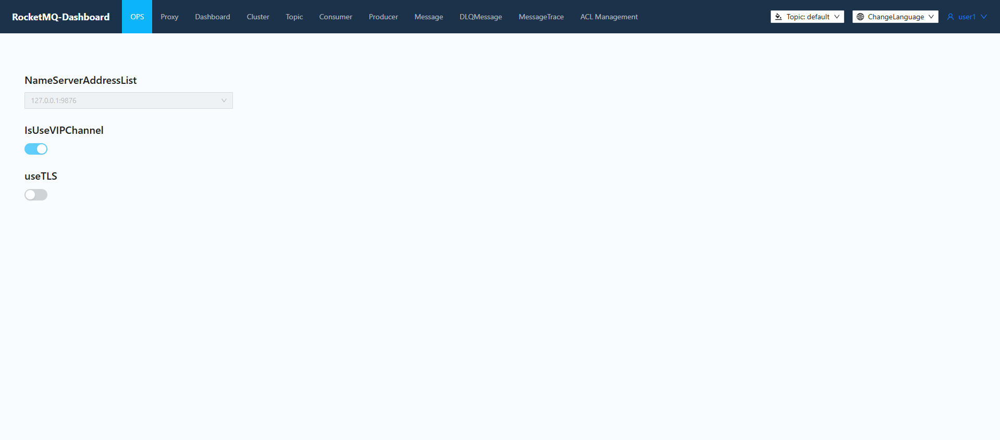
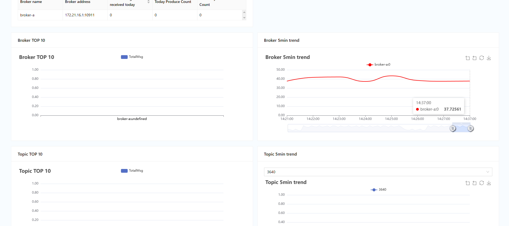
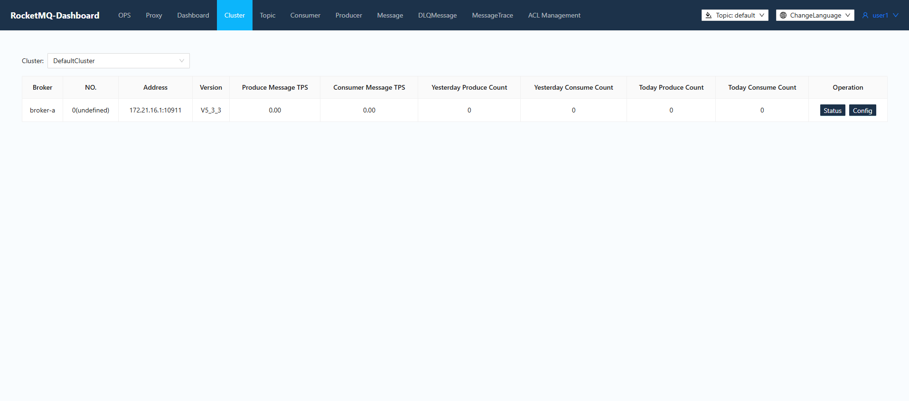
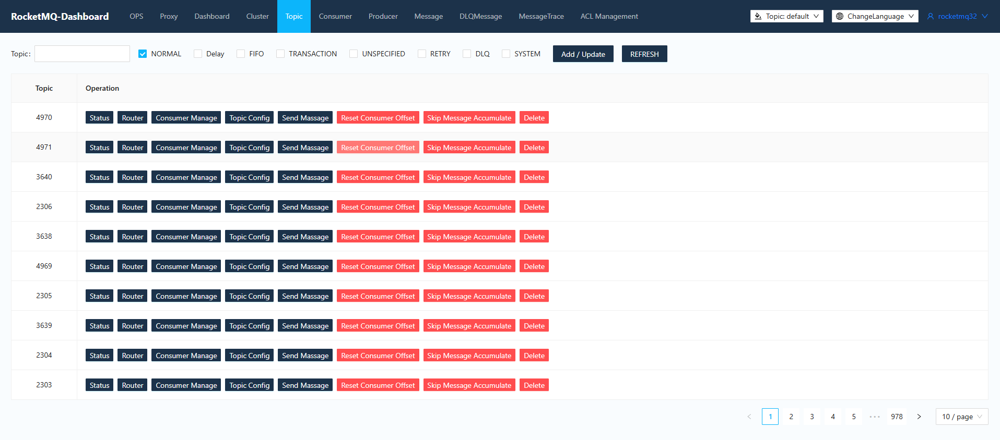
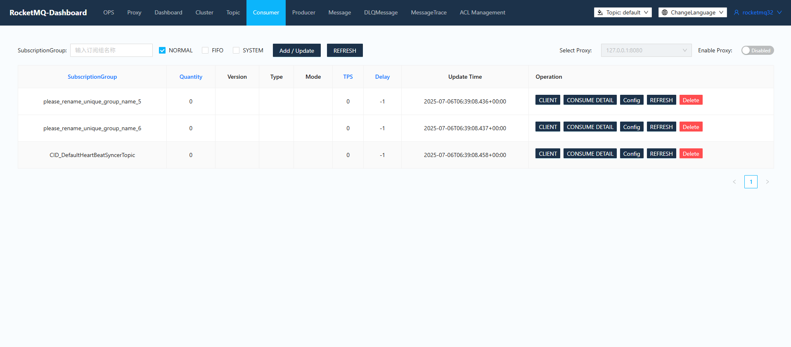
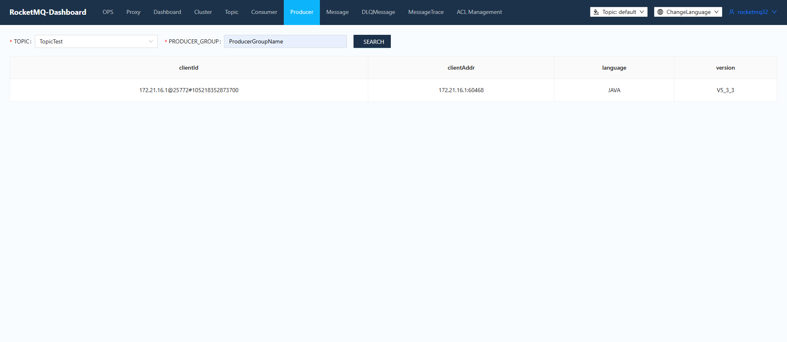
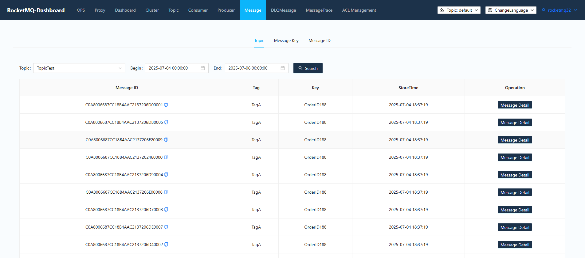
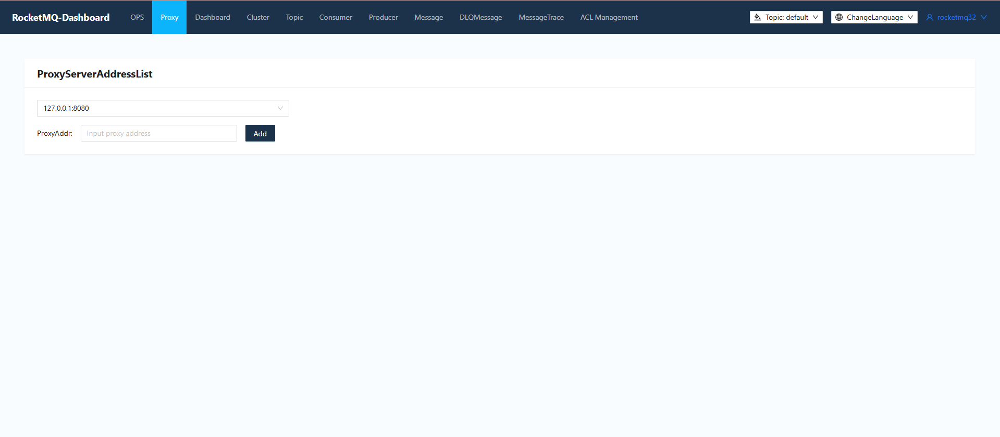
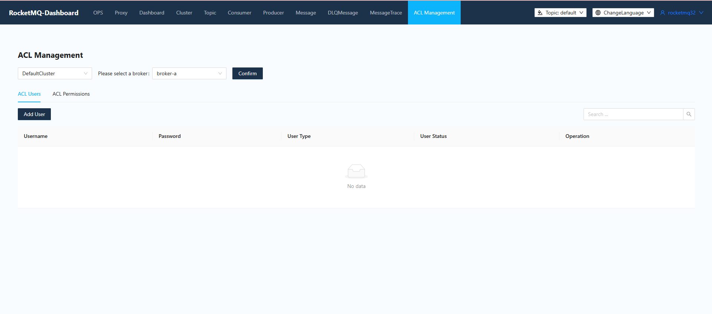

# RocketMQ Usage Documentation

---

## Operations Page
* You can **modify the NameSrv address** used by this service.
* You can configure whether this service uses **VIPChannel** (if your MQ server version is less than 3.5.8, please set it to not use).



---

## Dashboard
* View the **broker's message volume** (total/5-minute chart).
* View a **single topic's message volume** (total/trend chart).



---

## Cluster Page
* View the **cluster distribution**.
    * Cluster and broker relationships.
    * Broker information.
* View **specific broker information/runtime information**.
* View **broker configuration information**.



---

## Topic Page
* Display all topics, filterable via a **search box**.
* **Filter topics** by normal, retry, or dead-letter types.
    * Supports filtering for delayed, ordered, and transactional messages.
    * Supports adding and updating topics of various message types: delayed, ordered, transactional, and normal.
* **Add/Update Topic**:
    * **clusterName**: Specify which clusters to create the topic on.
    * **brokerName**: Specify which brokers to create the topic on.
    * **topicName**: The name of the topic.
    * **writeQueueNums**: Number of write queues.
    * **readQueueNums**: Number of read queues.
    * **perm**: // 2 for write, 4 for read, 6 for read/write.
* **Status**: Query message delivery status (which brokers/queues delivered to, quantity, etc.).
* **Routing**: View message routing (which brokers messages for this topic will be sent to, and corresponding broker queue information).
* **Consumer Management**: See which groups are consuming this topic and their consumption status.
* **Topic Configuration**: View and modify the current configuration.
* **Send Message**: Send a test message to this topic.
* **Reset Consumer Offset**: Available for both online and offline scenarios, though success should always be verified.
* **Delete Topic**: Deletes all topic configurations and routing information from all brokers and NameSrvs.



---

## Consumer Page
* Display all **consumer groups**, filterable via a search box.
* **Refresh** page.
* **Sort** by subscription group, quantity, TPS, or latency.
* **Add/Update Consumer Group**:
    * **clusterName**: Specify on which clusters to create.
    * **brokerName**: Specify on which brokers to create.
    * **groupName**: Consumer group name.
    * **consumeEnable**: // Whether consumption is enabled. If `FALSE`, consumption will be disabled.
    * **consumeBroadcastEnable**: // Whether broadcast consumption is enabled.
    * **retryQueueNums**: // Size of the retry queue.
    * **brokerId**: // Normally consume from this broker.
    * **whichBrokerWhenConsumeSlowly**: // Which broker to consume from if issues arise.
* **Terminal**: View online consumer clients, including version, subscription information, and consumption mode.
* **Consumption Details**: View detailed consumption information for the corresponding consumer group, including the consumption status of all subscribed topics and the consumer client for each queue (including retry messages).
* **Configuration**: View and modify the consumer group's configuration.
* **Delete**: Delete the consumer group on the specified broker.
* **Query using Proxy**:
* **Consumption Page**:
    * Supports filtering for **ordered consumption type subscription groups**.
    * Provides **adding and updating for ordered consumption type subscription groups**. If ordered consumption needs to be enabled, the `consumeOrderlyEnable` option must be turned on for FIFO type subscription groups.



---

## Publishing Management Page
* Query online **message producer clients** by Topic and Group.
    * Information includes client host and version.



---

## Message Query Page
* Query by **Topic and Time Range**.
    * Due to large data volume, a maximum of 2000 entries will be displayed; additional results will be ignored.
* Query by **Topic and Key**.
    * A maximum of 64 entries will be displayed.
* Query messages by **message topic and message ID**.
* **Message Details** can display comprehensive information about the message and its consumption status by specific consumer groups (including specific error information if an exception occurred). Messages can be re-sent to specified consumer groups.



---

## Proxy Page
* **Proxy Page** (New in RocketMQ 5.0)
    * Supports adding and querying **proxy nodes**.
    * Supports **proxy node address configuration**: `proxyAddr` and `proxyAddrs` properties can be pre-configured in `application.yml`.



---

## ACL 2.0 Management Interface
* Supports querying **ACL rules** based on broker addresses.
* **Modification, addition, deletion, and lookup** of ACL rules.
* (ACL 1.0 is no longer supported.)



---

## HTTPS Access to Dashboard
The HTTPS feature is implemented using Spring Boot's configuration capabilities. First, you'll need an **SSL KeyStore** to store the server certificate. You can use the test keystore provided by this project: `resources/rmqcngkeystore.jks`, which can be generated using the following `keytool` commands:

```bash
# Generate a keystore and add a private key with the alias 'rmqcngKey'
keytool -genkeypair -alias rmqcngKey  -keyalg RSA -validity 3650 -keystore rmqcngkeystore.jks
# View keystore content
keytool -list -v -keystore rmqcngkeystore.jks
# Convert keystore format
keytool -importkeystore -srckeystore rmqcngkeystore.jks -destkeystore rmqcngkeystore.jks -deststoretype pkcs12
```

Configure `resources/application.properties` by enabling the SSL-related options. HTTPS will be enabled after starting the dashboard.


```Properties
# Set HTTPS port
server.port=8443

### SSL setting
#server.ssl.key-store=classpath:rmqcngkeystore.jks
#server.ssl.key-store-password=rocketmq
#server.ssl.keyStoreType=PKCS12
#server.ssl.keyAlias=rmqcngkey
```

------


## Login and Access Dashboard


The Dashboard supports **logging in with a username and password** and logging out after operations. The following settings are required:

1. In the Spring configuration file `resources/application.properties`, modify `rocketmq.config.loginRequired=true` to **enable the login function**:

   

   ```Properties
   # Enable login function
   rocketmq.config.loginRequired=true
   
   # Dashboard file directory, where the login user configuration file is located
   rocketmq.config.dataPath=/tmp/rocketmq-console/data
   ```

2. Ensure that the directory defined by `${rocketmq.config.dataPath}` exists and create a login configuration file named "**users.properties**" within it. If this file doesn't exist, `resources/users.properties` will be used by default. **Note:** If RocketMQ's ACL is enabled, the console must configure AK and SK. Additionally, `rocketmq.config.authmode` in `application.yml` needs to be set to `acl` and the login function must be enabled for proper operation. After logging in, the username and password from ACL 2.0 will be used to construct the RPCHook for communication with the broker. The format of the `users.properties` file is:

   

   ```Properties
   # This file supports hot modification; adding and modifying users does not require restarting the console.
   # Format: Each line defines a user, username=password[,N] #N is optional, 0 for normal user; 1 for administrator.
   
   # Define administrator
   admin=admin,1
   
   # Define normal users
   user1=user1
   user2=user2
   ```

3. Starting the console will enable the login function.

------


## Permission Verification


If the user accesses the console with the login function enabled, interface access will be controlled based on the logged-in role.

1. In the Spring configuration file `resources/application.properties`, modify `rocketmq.config.loginRequired=true` to **enable the login function**:

   ```Properties
   # Enable login function
   rocketmq.config.loginRequired=true
   
   # Dashboard file directory, where the login user configuration file is located
   rocketmq.config.dataPath=/tmp/rocketmq-console/data
   ```
   
2. Ensure that the directory defined by `${rocketmq.config.dataPath}` exists and create an access permission configuration file named "**role-permission.yml**" within it. If this file doesn't exist, `resources/role-permission.yml` will be used by default. This file saves all accessible interface addresses for the normal user role. The format of the `role-permission.yml` file is:

   ```YAML
   # This file supports hot modification; adding and deleting interface permissions directly in the list.
   # Interface path configuration supports wildcards:
   # * Matches 0 or more characters that are not '/'.
   # ** Matches 0 or more arbitrary characters.
   # ?  Matches 1 arbitrary character.
   
   rolePerms:
     # Normal user
     Normal:
       - /rocketmq/nsaddr
       - /ops/*
       - /dashboard/**
       - /topic/*.query
       - /topic/sendTopicMessage.do
       - /producer/*.query
       - /message/*
       - /messageTrace/*
       - /monitor/*
       ....
   ```

3. On the frontend page, to better distinguish between normal user and admin user permissions, operation buttons for resource deletion and updates are **not displayed for normal user roles**. To perform resource-related operations, you need to log out and log in with the admin role.